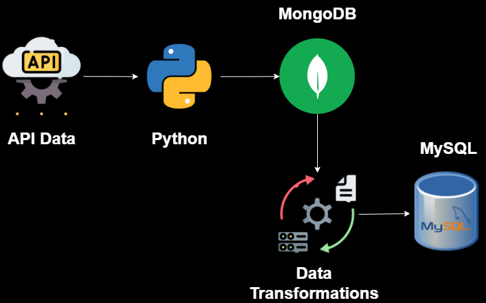

# Construindo um Pipeline de Dados Utilizando Python

## Disclaimer
Este projeto é um exemplo de pipeline de dados utilizando Python, MongoDB e MySQL. O objetivo é demonstrar como integrar essas tecnologias para extrair, transformar e carregar dados.

## Descrição do Projeto
Integração do Python com o MongoDB, criação de bancos de dados e coleções utilizando o PyMongo, extração de dados de APIs, transformação de dados, configuração e utilização do MySQL com o Python.

Tudo feito e configurado num ambiente virtual do Python utilizando o WSL (Windows Subsystem for Linux) com Ubuntu 22.04 LTS.

## Arquitetura do Projeto

A arquitetura do projeto é composta pelos seguintes componentes:

1. **API**: Fonte de dados que fornece os dados de vendas de produtos para serem processados.
2. **MongoDB**: Banco de dados NoSQL usado para armazenar os dados semi-estruturados ou não estruturados.
3. **Python Scripts**: Realizam a extração, transformação e carga (ETL) dos dados.
4. **MySQL**: Banco de dados relacional usado para armazenar dados estruturados.

## Ferramentas Utilizadas

- **Python**: Usado para a lógica ETL.
  - **Bibliotecas**:
    - `pymongo`: Para conectar ao MongoDB.
    - `mysql-connector-python`: Para conectar ao MySQL.
- **MongoDB/MongoDB Atlas**: Banco de dados NoSQL para armazenamento inicial de dados.
- **MySQL**: Banco de dados relacional para armazenamento final de dados transformados.

### Razões para Escolher Estas Ferramentas

- **Python**: Oferece uma ampla variedade de bibliotecas e uma comunidade ativa, facilitando a manipulação de dados.
- **MongoDB**: Excelente para lidar com dados não estruturados e semi-estruturados.
- **MySQL**: Amplamente usado em aplicações para armazenamento de dados estruturados, oferecendo robustez e performance.
